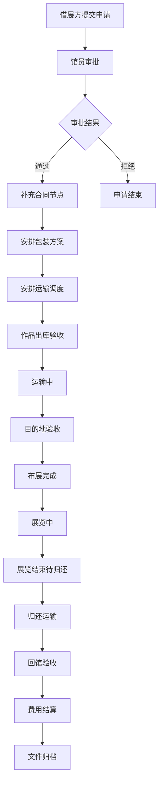

## 1. 产品概述

本系统为小型美术馆提供展览借展全流程数字化管理，覆盖展品档案管理、借展申请审批、运输安排、状态追踪及文档归档五大核心模块，解决借展流程中信息分散、状态不透明、文档易丢失等痛点。

- 目标用户：美术馆馆员、借展方对接人
- 核心价值：实现借展流程标准化、状态可视化、文档集中化管理

## 2. 核心功能

### 2.1 用户角色

| 角色 | 登录方式 | 核心权限 |
|------|----------|----------|
| 美术馆馆员 | 账号登录 | 展品档案管理、审批借展申请、安排运输、更新状态、管理文档 |
| 借展方 | 账号登录/链接访问 | 提交借展申请、查看借展状态、上传验收资料 |

### 2.2 功能模块

1. **展品档案**：作品信息录入、图片管理、筛选搜索、档案详情
2. **借展申请**：申请提交、审批流程、合同节点管理
3. **运输安排**：包装方案、运输调度、物流信息记录
4. **状态追踪**：全流程时间线、阶段切换、验收记录、费用明细
5. **文档中心**：合同文件、保险单据、验收报告、归档管理

### 2.3 页面详情

| 页面名称 | 模块名称 | 功能描述 |
|----------|----------|----------|
| 展品档案 | 作品列表 | 卡片式展示作品缩略图、名称、作者、尺寸，支持按分类/年代/作者筛选搜索 |
| 展品档案 | 作品录入表单 | 录入作品名称、作者、年代、材质、尺寸（高/宽/深）、重量、保险估值、保存条件（温湿度、光照要求）、高清图片上传、状态标记 |
| 展品档案 | 作品详情抽屉 | 完整展示作品档案信息、多图轮播、借展历史记录 |
| 借展申请 | 申请列表 | 展示所有借展申请，按状态（待审批/已批准/已拒绝）分类，支持搜索筛选 |
| 借展申请 | 申请表单（借展方） | 填写借展方名称、联系人、联系方式、展期起止、场地地址、展览名称、借展用途、拟借作品选择 |
| 借展申请 | 审批面板（馆员） | 查看申请详情、审批通过/拒绝、补充合同节点（签约、首付款、交付等里程碑）、填写审批意见 |
| 运输安排 | 运输任务列表 | 按状态（待安排/包装中/待发运/运输中/已送达）展示运输任务 |
| 运输安排 | 包装方案 | 记录包装材料、包装方式、装箱清单、包装照片上传 |
| 运输安排 | 运输调度 | 选择承运商、填写运单号、运输路线、运输人员、预计发运/到达时间 |
| 状态追踪 | 时间线总览 | 可视化展示从"待审批→待出库→运输中→已布展→待归还→运输中→已归还→已归档"全流程阶段 |
| 状态追踪 | 状态操作 | 馆员可切换当前阶段、记录阶段操作时间、操作人备注 |
| 状态追踪 | 验收记录 | 出入库验收照片上传、损伤情况备注、双方签字确认 |
| 状态追踪 | 费用明细 | 记录运输费、包装费、保险费、租赁费等各项费用，自动汇总总额 |
| 文档中心 | 文档分类 | 按合同、保险、验收报告、运输单据、其他分类展示 |
| 文档中心 | 文档上传 | 支持多文件上传、关联借展项目、添加文档描述、标签 |
| 文档中心 | 文档管理 | 预览、下载、版本管理、归档操作 |

## 3. 核心流程

### 3.1 借展主流程

借展方向美术馆提出借展申请，馆员审批通过后安排包装与运输，作品出库后全程追踪状态，布展完成后进入展览阶段，展览结束后安排归还，最终验收归档。

## 4. 用户界面设计

### 4.1 设计风格

- **主色调**：深邃墨黑 `#0A0A0A`、暖米白 `#F5F1EA`、典雅金 `#B8956A`
- **辅助色**：墨绿 `#3D5A45`（通过/完成状态）、砖红 `#8B4A3A`（警告/拒绝）、石青 `#5B7B8C`（进行中）
- **按钮风格**：直角微圆角（2px）、细线描边、悬浮时金色底纹渐变
- **字体**：标题用 Playfair Display（优雅衬线），正文用 Noto Sans SC（思源黑体）
- **布局风格**：侧边栏导航 + 顶部面包屑，主内容区卡片式布局，大量留白营造画廊质感
- **图标风格**：线性细描边图标，统一 1.5px 线条宽度

### 4.2 页面设计概览

| 页面名称 | 模块名称 | UI 元素 |
|----------|----------|----------|
| 展品档案 | 作品列表 | 等宽瀑布流卡片、悬停放大预览、顶部筛选栏带搜索框 |
| 展品档案 | 作品详情 | 右侧抽屉滑入、左侧大图轮播、右侧信息分栏排版 |
| 借展申请 | 申请列表 | 表格视图 + 状态标签色块、行内操作按钮 |
| 借展申请 | 审批面板 | 左右分栏：左侧申请信息、右侧审批操作区 |
| 运输安排 | 任务看板 | 看板列视图（Kanban）、可拖拽卡片切换状态 |
| 状态追踪 | 时间线 | 垂直时间线、当前阶段高亮金色脉冲动画、已完成绿色打勾 |
| 状态追踪 | 费用明细 | 分组列表、末行汇总金额、金额右对齐排版 |
| 文档中心 | 文档列表 | 图标网格视图 + 列表视图切换、悬浮出现操作按钮 |

### 4.3 响应式设计

- **Desktop First**：以 1440px 宽度为基准设计
- 平板端（≥768px）：侧边栏收窄为图标模式，卡片列数自适应
- 移动端（<768px）：侧边栏转为底部 Tab 导航，时间线简化为步骤条
