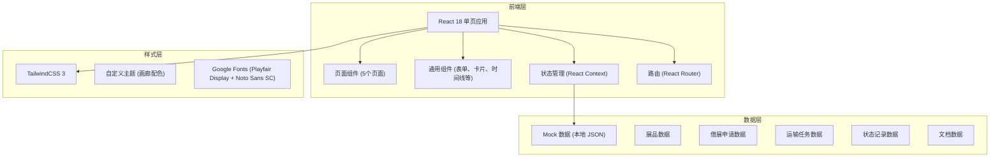
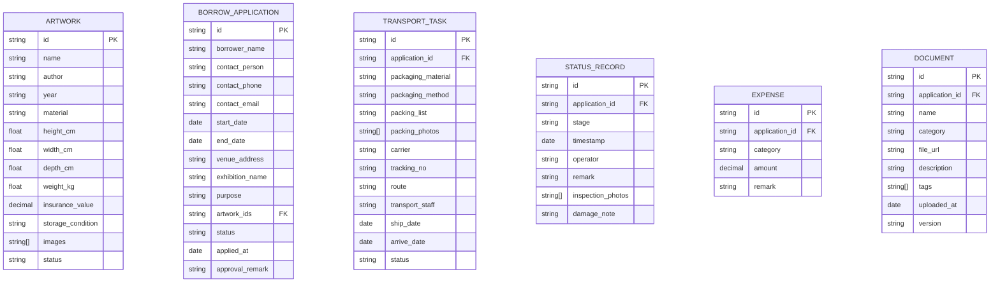

## 1. 架构设计



## 2. 技术选型说明

- **前端框架**：React@18 + TypeScript@5
- **构建工具**：Vite@5
- **样式方案**：TailwindCSS@3 + PostCSS + Autoprefixer
- **路由**：react-router-dom@6
- **图标库**：lucide-react（线性细描边图标，符合设计风格）
- **日期处理**：date-fns（轻量级日期格式化）
- **数据**：本地 Mock 数据 + React Context 状态管理，无需后端服务

## 3. 路由定义

| 路由路径 | 页面用途 |
|----------|----------|
| `/` | 重定向至 `/artworks` |
| `/artworks` | 展品档案页面 |
| `/applications` | 借展申请页面 |
| `/transportation` | 运输安排页面 |
| `/tracking` | 状态追踪页面 |
| `/documents` | 文档中心页面 |

## 4. 数据模型

### 4.1 ER 图



### 4.2 状态枚举

**展品状态 (ArtworkStatus)**
- `available` 在库可借
- `on_loan` 借出中
- `restoring` 修复中
- `archived` 已归档

**借展申请状态 (ApplicationStatus)**
- `pending` 待审批
- `approved` 已批准
- `rejected` 已拒绝

**运输任务状态 (TransportStatus)**
- `pending` 待安排
- `packing` 包装中
- `ready` 待发运
- `in_transit` 运输中
- `delivered` 已送达

**借展阶段 (BorrowStage)**
- `pending_approval` 待审批
- `pending_outbound` 待出库
- `in_transit_out` 外运中
- `installed` 已布展
- `pending_return` 待归还
- `in_transit_back` 归还中
- `returned` 已归还
- `archived` 已归档

## 5. 项目目录结构

```
src/
├── assets/            # 静态资源（字体、图片占位）
├── components/        # 通用组件
│   ├── Layout/        # 布局组件（Sidebar、Header）
│   ├── ui/            # UI 原子组件（Button、Input、Card、Tag、Timeline、Modal、Drawer）
│   └── shared/        # 业务通用组件（ArtworkCard、StatusBadge 等）
├── context/           # React Context（全局状态）
├── data/              # Mock 数据
├── pages/             # 页面组件
│   ├── Artworks.tsx
│   ├── Applications.tsx
│   ├── Transportation.tsx
│   ├── Tracking.tsx
│   └── Documents.tsx
├── types/             # TypeScript 类型定义
├── utils/             # 工具函数
├── App.tsx
├── main.tsx
└── index.css          # TailwindCSS 入口
```
